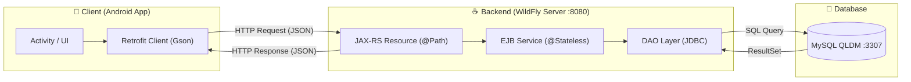

# 🛒 HỆ THỐNG QUẢN LÝ & BÁN HÀNG ĐIỆN MÁY (RESTFUL API & ANDROID APP)

> Dự án bài tập lớn môn **Kiến trúc và Thiết kế Phần mềm** (KT&TK Software)  
> Mô hình ứng dụng phân tán **Client - Server**: Backend Jakarta EE (WildFly) + Frontend Android App (Retrofit).

---

## 📑 MỤC LỤC
1. [Giới thiệu tổng quan](#-1-giới-thiệu-tổng-quan)
2. [Kiến trúc hệ thống & Công nghệ](#-2-kiến-trúc-hệ-thống--công-nghệ)
3. [Cấu trúc thư mục dự án](#-3-cấu-trúc-thư-mục-dự-án)
4. [Danh sách API Endpoints](#-4-danh-sách-api-endpoints)
5. [Hướng dẫn cài đặt & Triển khai](#-5-hướng-dẫn-cài-đặt--triển-khai)
   - [Bước 1: Khởi động Cơ sở dữ liệu MySQL](#bước-1-khởi-động-cơ-sở-dữ-liệu-mysql)
   - [Bước 2: Build & Deploy Backend lên WildFly](#bước-2-build--deploy-backend-lên-wildfly)
   - [Bước 3: Khởi chạy Ứng dụng Android](#bước-3-khởi-chạy-ứng-dụng-android)
6. [Luồng hoạt động của hệ thống (Data Flow)](#-6-luồng-hoạt-động-của-hệ-thống-data-flow)
7. [Xử lý các lỗi thường gặp](#-7-xử-lý-các-lỗi-thường-gặp)

---

## 🌟 1. Giới thiệu tổng quan

Hệ thống cho phép khách hàng tra cứu, xem chi tiết sản phẩm điện máy, áp dụng voucher giảm giá, quản lý giỏ hàng, đăng nhập tài khoản và đặt hàng trực tuyến thông qua ứng dụng di động Android. Dữ liệu được quản trị tập trung trên Backend Server thông qua chuẩn giao tiếp RESTful API.

---

## 🏗️ 2. Kiến trúc hệ thống & Công nghệ

### ⚙️ Backend Webserver (`Server_API_DienMay`)
- **Nền tảng**: Jakarta EE 10 (Full Profile).
- **Application Server**: WildFly 27+ / 40.0.1.Final (Cổng `8080`).
- **RESTful Web Services**: Jakarta REST (JAX-RS) với `ApplicationConfig` (`@ApplicationPath("/api")`).
- **Enterprise JavaBeans (EJB)**: Stateless Session Beans (`@Stateless`) đảm nhiệm tầng nghiệp vụ (Business Logic) và quản lý vòng đời / đa luồng.
- **Cơ sở dữ liệu**: MySQL / MariaDB (Cổng `3307`, Database: `QLDM`).
- **Kết nối CSDL**: JDBC Driver `mysql-connector-j 9.3.0` với kỹ thuật `try-with-resources` chống rò rỉ kết nối (Connection Leaks).
- **Bộ lọc CORS**: Hỗ trợ gọi API chéo nguồn từ Browser, Postman Web, Web Frontend.
- **Công cụ build**: Apache Maven (`war` packaging).

### 📱 Frontend Client (`BTL Rest_API`)
- **Nền tảng**: Android SDK (Java).
- **Mạng (Networking)**: Retrofit 2 + OkHttp.
- **JSON Parser**: Google Gson Converter.
- **Giao diện**: Material Design Components, RecyclerView, SharedPreferences.

---

## 📁 3. Cấu trúc thư mục dự án

```text
KT&TK software/
│
├── Server_API_DienMay/                 # [BACKEND] REST API SERVER (Jakarta EE)
│   ├── pom.xml                         # Cấu hình Maven, dependencies và build war
│   └── src/main/
│       ├── java/
│       │   ├── entity/                 # Các thực thể dữ liệu (POJO)
│       │   │   ├── User.java
│       │   │   ├── Product.java
│       │   │   ├── Category.java
│       │   │   ├── Order.java
│       │   │   ├── OrderDetail.java
│       │   │   ├── Promotion.java
│       │   │   └── OrderRequest.java
│       │   ├── dao/                    # Tầng truy vấn dữ liệu JDBC (DAO Pattern)
│       │   │   ├── DBConnection.java   # Quản lý kết nối MySQL
│       │   │   ├── UserDAO.java
│       │   │   ├── ProductDAO.java
│       │   │   ├── CategoryDAO.java
│       │   │   ├── OrderDAO.java
│       │   │   ├── OrderDetailDAO.java
│       │   │   └── PromotionDAO.java
│       │   ├── service/                # Tầng nghiệp vụ EJB (@Stateless)
│       │   │   ├── UserServiceBean.java
│       │   │   ├── ProductServiceBean.java
│       │   │   ├── CategoryServiceBean.java
│       │   │   ├── OrderServiceBean.java
│       │   │   └── PromotionServiceBean.java
│       │   └── rest/                   # Tầng API Endpoints (JAX-RS)
│       │       ├── ApplicationConfig.java # Cấu hình root path /api
│       │       ├── CORSFilter.java        # Bộ lọc CORS
│       │       ├── UserResource.java      # /api/users
│       │       ├── ProductResource.java   # /api/products
│       │       ├── CategoryResource.java  # /api/categories
│       │       ├── OrderResource.java     # /api/order
│       │       └── PromotionResource.java # /api/vouchers
│       └── webapp/WEB-INF/
│           ├── web.xml                 # Deployment descriptor
│           └── jboss-web.xml           # Cố định context-root Server_API_DienMay-1.0-SNAPSHOT
│
└── BTL Rest_API/                       # [FRONTEND] ANDROID CLIENT APP
    ├── app/
    │   ├── build.gradle.kts            # Cấu hình Retrofit, Gson, Android dependencies
    │   └── src/main/
    │       ├── AndroidManifest.xml     # Cấp quyền INTERNET
    │       ├── java/com/example/dienmayapp/
    │       │   ├── activity/           # Màn hình (DangNhap, TrangChu, ChiTiet, ...)
    │       │   ├── adapter/            # Adapter hiển thị RecyclerView
    │       │   ├── api/
    │       │   │   ├── RetrofitClient.java # Cấu hình BASE_URL (http://10.0.2.2:8080/...)
    │       │   │   └── ApiService.java     # Định nghĩa các phương thức gọi API
    │       │   └── model/              # Model dữ liệu phía Android
    │       └── res/                    # Layouts, Drawable, Values
    └── build.gradle.kts
```

---

## 📡 4. Danh sách API Endpoints

**Base URL**: `http://localhost:8080/Server_API_DienMay-1.0-SNAPSHOT/api`  
*(Trên máy ảo Android Emulator thay `localhost` bằng `10.0.2.2`)*

### 👤 1. Người dùng (`/users`)
| Phương thức | Endpoint | Mô tả | Body / Tham số | Phản hồi |
|---|---|---|---|---|
| `GET` | `/users` | Lấy danh sách người dùng | Không | `200 OK` (JSON List) |
| `GET` | `/users/{id}` | Lấy chi tiết người dùng | `id` (int) | `200 OK` / `404 Not Found` |
| `POST` | `/users` | Thêm/Đăng ký người dùng | `User` (JSON) | `201 Created` |
| `PUT` | `/users/{id}` | Cập nhật thông tin | `User` (JSON) | `200 OK` |
| `DELETE` | `/users/{id}` | Xóa người dùng | `id` (int) | `200 OK` |
| `POST` | `/users/login` | Đăng nhập tài khoản | `{"username": "...", "password": "..."}` | `200 OK` (User) / `401 Unauthorized` |
| `GET` | `/users/search/{keyword}` | Tìm kiếm tài khoản | `keyword` (String) | `200 OK` (JSON List) |

### 📦 2. Sản phẩm (`/products`)
| Phương thức | Endpoint | Mô tả | Body / Tham số | Phản hồi |
|---|---|---|---|---|
| `GET` | `/products` | Lấy tất cả sản phẩm | Không | `200 OK` (JSON List) |
| `GET` | `/products/{id}` | Lấy chi tiết sản phẩm | `id` (int) | `200 OK` / `404 Not Found` |
| `POST` | `/products` | Thêm sản phẩm mới | `Product` (JSON) | `201 Created` |
| `PUT` | `/products/{id}` | Cập nhật sản phẩm | `Product` (JSON) | `200 OK` |
| `DELETE` | `/products/{id}` | Xóa sản phẩm | `id` (int) | `200 OK` |
| `GET` | `/products/search/{keyword}`| Tìm sản phẩm theo tên/mô tả | `keyword` (String) | `200 OK` (JSON List) |

### 🏷️ 3. Loại hàng (`/categories`)
| Phương thức | Endpoint | Mô tả | Body / Tham số | Phản hồi |
|---|---|---|---|---|
| `GET` | `/categories` | Danh sách danh mục | Không | `200 OK` (JSON List) |
| `GET` | `/categories/{id}` | Chi tiết danh mục | `id` (int) | `200 OK` / `404 Not Found` |
| `POST` | `/categories` | Thêm danh mục | `Category` (JSON) | `201 Created` |
| `PUT` | `/categories/{id}` | Sửa danh mục | `Category` (JSON) | `200 OK` |
| `DELETE` | `/categories/{id}` | Xóa danh mục | `id` (int) | `200 OK` |

### 🎟️ 4. Khuyến mãi / Voucher (`/vouchers`)
| Phương thức | Endpoint | Mô tả | Body / Tham số | Phản hồi |
|---|---|---|---|---|
| `GET` | `/vouchers` | Danh sách tất cả voucher | Không | `200 OK` (JSON List) |
| `POST` | `/vouchers` | Tạo mã giảm giá mới | `Promotion` (JSON) | `201 Created` |
| `PUT` | `/vouchers/{code}` | Sửa voucher | `Promotion` (JSON) | `200 OK` |
| `DELETE` | `/vouchers/{code}` | Xóa voucher | `code` (String) | `200 OK` |
| `GET` | `/vouchers/check/{total}` | Tìm voucher phù hợp theo tổng tiền | `total` (double) | `200 OK` (Promotion) |

### 💳 5. Đơn hàng (`/order`)
| Phương thức | Endpoint | Mô tả | Body / Tham số | Phản hồi |
|---|---|---|---|---|
| `POST` | `/order/create` | Tạo mới đơn hàng | `OrderRequest` (JSON) | `200 OK` / `400 Bad Request` |

---

## 🚀 5. Hướng dẫn cài đặt & Triển khai

### Bước 1: Khởi động Cơ sở dữ liệu MySQL
1. Mở **XAMPP Control Panel**.
2. Bấm **Start** dịch vụ **MySQL** (cổng `3307`).
3. Đảm bảo đã import CSDL tên **`QLDM`** với mật khẩu tài khoản `root` là `123456`.  
   *(Nếu bạn dùng cổng khác hoặc mật khẩu khác, hãy cập nhật tại [`DBConnection.java`](file:///d:/Study/2025-2026/KT&TK%20software/Server_API_DienMay/src/main/java/util/DBConnection.java)).*

### Bước 2: Build & Deploy Backend lên WildFly
1. Mở Terminal tại thư mục `Server_API_DienMay` và chạy lệnh Maven đóng gói:
   ```bash
   mvn clean package
   ```
   *(File đóng gói sẽ được tạo tại `target/Server_API_DienMay-1.0-SNAPSHOT.war`)*.
2. Sao chép file `.war` vào thư mục deployments của WildFly:
   ```text
   D:\Set up\wildfly-40.0.1.Final\standalone\deployments\
   ```
3. Chạy file **`standalone.bat`** tại `D:\Set up\wildfly-40.0.1.Final\bin\` để khởi động server.  
   Server khởi động thành công khi xuất hiện thông báo:
   ```text
   WildFly ... started in ...ms - Started ... of ... services
   ```
4. Kiểm tra trên trình duyệt: Truy cập `http://localhost:8080/Server_API_DienMay-1.0-SNAPSHOT/api/products` để xem danh sách JSON trả về.

### Bước 3: Khởi chạy Ứng dụng Android
1. Mở **Android Studio**, chọn **Open Project** -> trỏ đến thư mục `BTL Rest_API`.
2. Đợi Gradle Sync hoàn tất.
3. Bật máy ảo **Android Emulator** (Pixel / Nexus bất kỳ).
4. Nhấn nút **Run ▶️** (hoặc `Shift + F10`) để cài đặt và trải nghiệm ứng dụng.

---

## 🔄 6. Luồng hoạt động của hệ thống (Data Flow)



- **Mô phỏng ví dụ chức năng Đăng Nhập**:
  1. Người dùng nhập tài khoản/mật khẩu tại `DangNhapActivity` và bấm **Đăng nhập**.
  2. `RetrofitClient` đóng gói dữ liệu thành JSON và gửi `POST` tới `http://10.0.2.2:8080/Server_API_DienMay-1.0-SNAPSHOT/api/users/login`.
  3. `UserResource` tiếp nhận và chuyển dữ liệu tới `UserServiceBean` (EJB).
  4. `UserServiceBean` gọi `UserDAO` thực thi truy vấn SQL `SELECT * FROM User WHERE username=? AND password=?`.
  5. Nếu khớp, server trả về `200 OK` kèm thông tin `User`. Ứng dụng Android lưu phiên đăng nhập vào `SharedPreferences` và chuyển hướng vào màn hình chính.

---

## 🛠️ 7. Xử lý các lỗi thường gặp

### ❌ 1. MySQL trong XAMPP báo lỗi "Error: MySQL shutdown unexpectedly"
- **Nguyên nhân**: Bị tắt đột ngột dẫn đến checkpoint redo log của InnoDB bị hỏng.
- **Cách khắc phục**:
  1. Mở file `C:\xampp\mysql\bin\my.ini`.
  2. Dưới mục `[mysqld]`, thêm dòng: `innodb_force_recovery = 1`.
  3. Bấm **Start** lại MySQL trên XAMPP.

### ❌ 2. Android App báo lỗi mạng / không tải được dữ liệu
- **Nguyên nhân 1**: Máy ảo không thể kết nối tới `localhost`.  
  👉 **Khắc phục**: Đảm bảo trong `RetrofitClient.java` sử dụng địa chỉ `http://10.0.2.2:8080/...` đối với máy ảo Android Studio. Nếu chạy trên **điện thoại thật cắm cáp**, hãy đổi `10.0.2.2` thành địa chỉ IPv4 LAN của máy tính (ví dụ: `http://192.168.1.15:8080/...`).
- **Nguyên nhân 2**: Chưa bật MySQL hoặc chưa khởi động WildFly.  
  👉 **Khắc phục**: Kiểm tra lại bước 1 và bước 2 trong mục Hướng dẫn cài đặt.

---
*Tài liệu được khởi tạo và tối ưu hóa tự động dành riêng cho đề tài Kiến trúc & Thiết kế Phần mềm.*
